# Etapa 2 — Identificação e Classificação de Bugs

## 2.1 Classificação dos bugs

Dois bugs foram classificados como **Dependência vulnerável**, pois estão relacionados a uma versão vulnerável do Multer. O terceiro foi classificado como **Segurança**, pois a ausência de limitação de requisições pode permitir um ataque de negação de serviço.

| Bug identificado | Categoria | Justificativa da classificação |
| --- | --- | --- |
| Multer vulnerável a negação de serviço por recursão descontrolada — alerta #14 | Dependência vulnerável | O projeto utiliza uma versão do Multer afetada por uma vulnerabilidade conhecida. |
| Ausência de limitação de requisições na rota de upload — alerta #8 | Segurança | Um usuário autenticado pode enviar muitas requisições e causar consumo excessivo de recursos. |
| Multer vulnerável a negação de serviço por campos profundamente aninhados — alerta #27 | Dependência vulnerável | A versão instalada permite o consumo excessivo de CPU e memória ao processar campos multipart manipulados. |

## 2.2 Uso de ferramenta de apoio

O grupo utilizou o **Dependabot alerts**, disponível no GitHub, para verificar as dependências do projeto. A ferramenta analisou o arquivo `package-lock.json` e encontrou versões com vulnerabilidades conhecidas. Também foi utilizado o **CodeQL**, ferramenta de análise estática do GitHub, para examinar o código-fonte. O CodeQL identificou que a rota de upload não possui limitação de requisições. Depois dos resultados automáticos, o código foi consultado para verificar se os alertas correspondem ao funcionamento real da aplicação.

## Localização dos bugs na arquitetura

O diagrama abaixo mostra o fluxo do upload de imagens e a localização dos três bugs identificados. O alerta do CodeQL está relacionado à rota `POST /api/posts`. Os alertas do Dependabot estão relacionados ao Multer, utilizado antes do armazenamento da imagem.

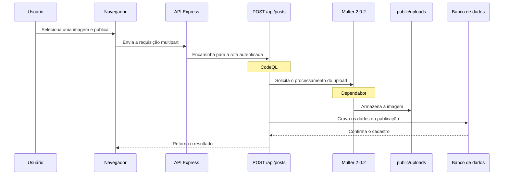

## Bug 1 — Vulnerabilidade de negação de serviço no Multer

**Tipo:** Dependência vulnerável  
**Local:** `package.json`, `package-lock.json` e `src/app.ts`  
**Ferramenta:** Dependabot alerts — alerta #14  
**Gravidade:** Alta — 8,7/10  
**Identificadores:** CVE-2026-3520 e GHSA-5528-5vmv-3xc2

### Descrição

O Dependabot identificou que o projeto utiliza o Multer na versão `2.0.2`. Essa versão é vulnerável a um ataque de negação de serviço por recursão descontrolada. Uma requisição multipart malformada pode causar um estouro de pilha e deixar o servidor indisponível.

### Funcionamento do problema

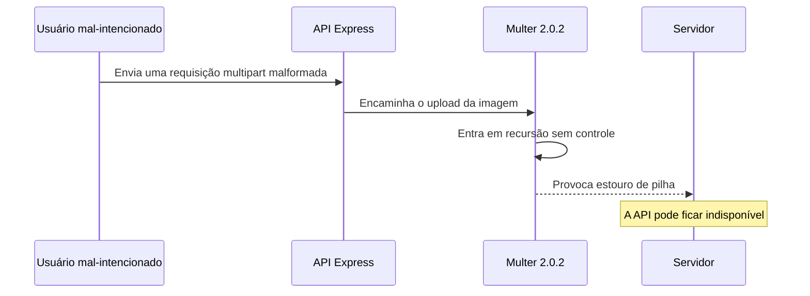

### Evidência do Dependabot

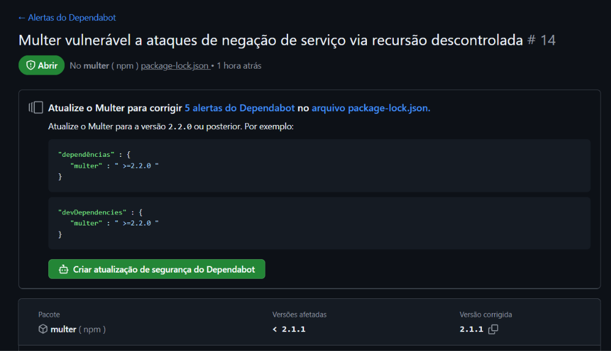

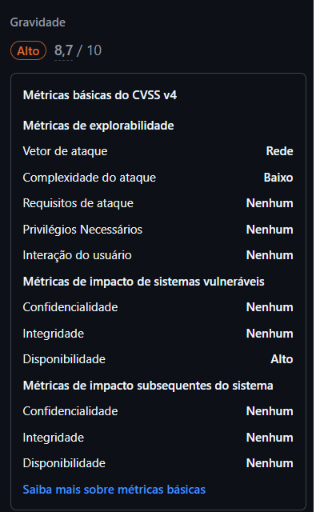

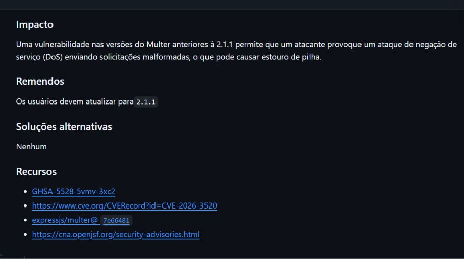

### Evidência no código

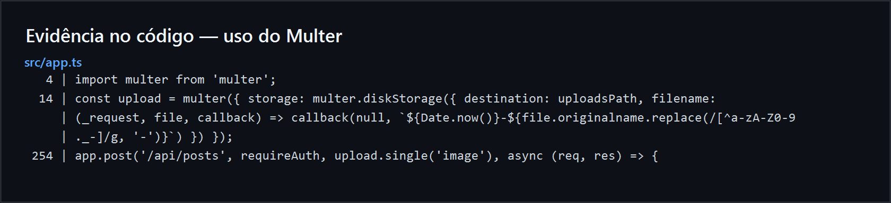

O arquivo `src/app.ts` importa e configura o Multer. A rota de criação de publicações utiliza `upload.single('image')` para receber as imagens enviadas pelos usuários.

### Análise de falso positivo

O alerta não foi considerado falso positivo. A versão vulnerável `2.0.2` está registrada no `package-lock.json`, e o Multer é utilizado diretamente na rota de upload da aplicação. Portanto, a biblioteca não está apenas instalada: ela é executada pelo sistema.

## Bug 2 — Ausência de limitação de requisições na rota de upload

**Tipo:** Segurança  
**Local:** `src/app.ts`, linha 254  
**Ferramenta:** CodeQL — alerta #8  
**Gravidade:** Alta

### Descrição

O CodeQL identificou que a rota `POST /api/posts` exige autenticação, mas não limita a quantidade de requisições que um usuário pode enviar em determinado período. Essa rota processa o upload de imagens com o Multer e grava a publicação no banco de dados. Um usuário autenticado pode enviar muitas requisições em sequência, aumentando o consumo de processamento, espaço em disco e conexões com o banco. Esse comportamento pode causar lentidão ou indisponibilidade da aplicação.

### Funcionamento do problema

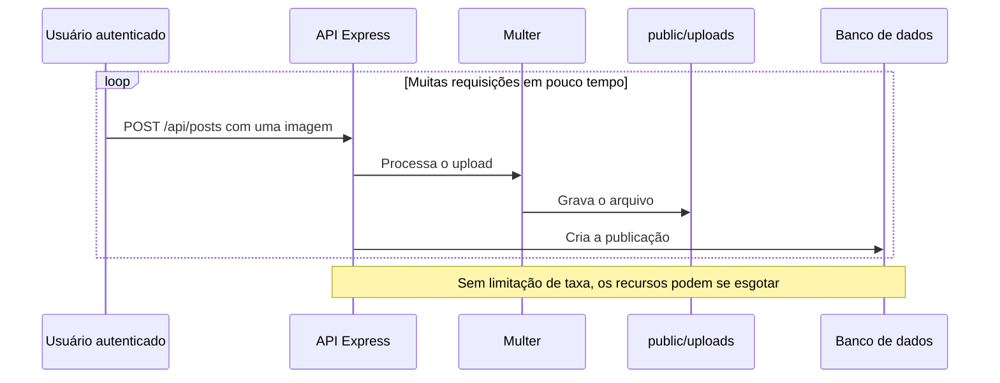

### Evidência do CodeQL

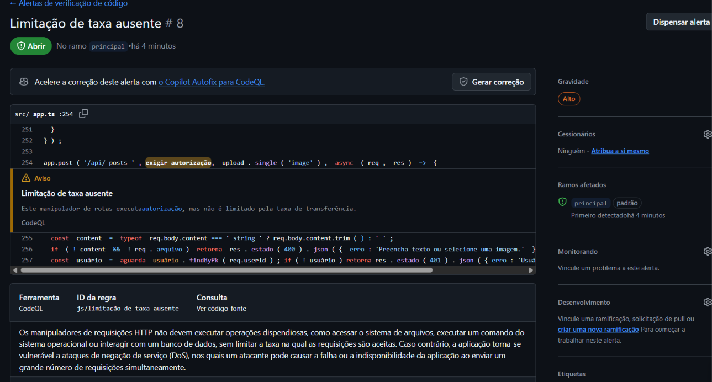

O print mostra o alerta de gravidade alta, a linha indicada pelo CodeQL e a explicação sobre o risco de executar operações custosas sem limitar a taxa de requisições.

### Análise de falso positivo

O alerta não foi considerado falso positivo. A rota utiliza `requireAuth`, mas esse middleware apenas verifica se o token é válido. Não existe um middleware que limite a quantidade de requisições por usuário ou endereço IP. A rota executa `upload.single('image')` e cria uma publicação no banco, confirmando que cada chamada consome recursos do servidor.

## Bug 3 — Negação de serviço por nomes de campos profundamente aninhados no Multer

**Tipo:** Dependência vulnerável  
**Local:** `package.json`, `package-lock.json` e `src/app.ts`  
**Ferramenta:** Dependabot alerts — alerta #27  
**Gravidade:** Alta — 7,5/10

### Descrição

O Dependabot identificou que versões do Multer entre `1.0.0` e `2.2.0` permitem um ataque de negação de serviço por meio de nomes de campos profundamente aninhados. A biblioteca interpreta a notação de colchetes presente nos nomes dos campos sem limitar a profundidade. Com isso, uma única requisição multipart manipulada pode criar objetos muito aninhados e consumir CPU e memória. O projeto utiliza a versão `2.0.2`, que está dentro do intervalo afetado.

### Funcionamento do problema

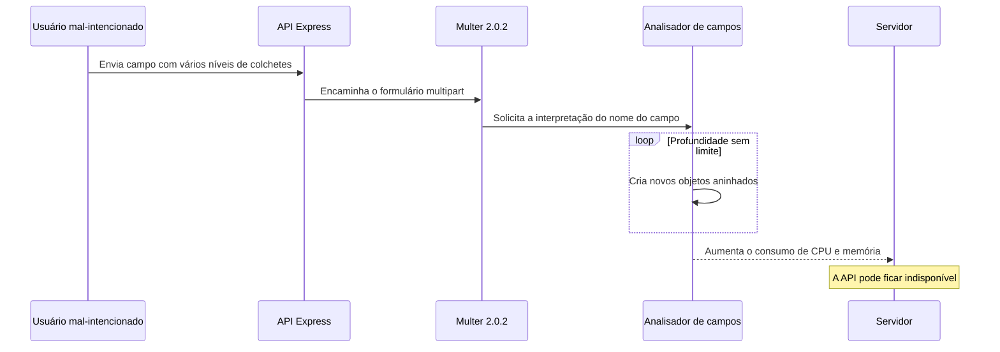

### Evidência do Dependabot

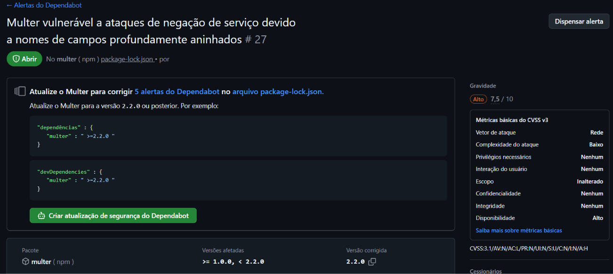

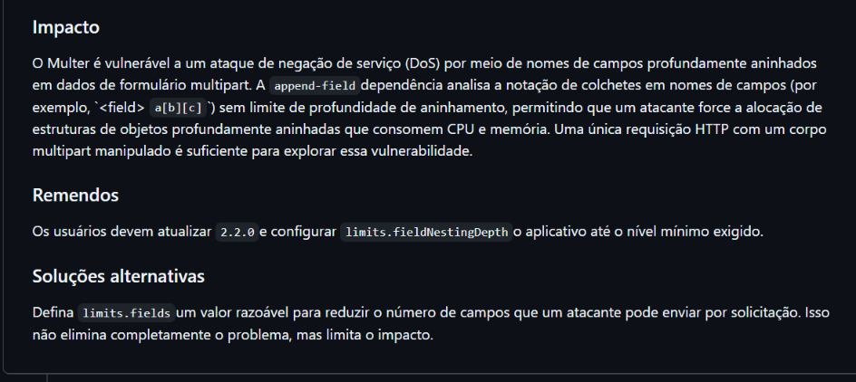

### Evidência no código

O arquivo `src/app.ts` configura o Multer sem definir limites para a profundidade e a quantidade de campos. A rota de criação de publicações recebe formulários multipart por meio de `upload.single('image')`.

### Análise de falso positivo

O alerta não foi considerado falso positivo. A versão `2.0.2` está dentro do intervalo vulnerável, o Multer é usado diretamente na rota de upload e a configuração atual não define `limits.fieldNestingDepth` nem `limits.fields`. Portanto, a rota processa o tipo de entrada descrito no alerta sem as limitações recomendadas.

## Situação nesta etapa

Os três bugs foram apenas identificados e classificados. Eles ainda não foram transformados em issues e não foram corrigidos, pois essas atividades serão realizadas na Etapa 3.
