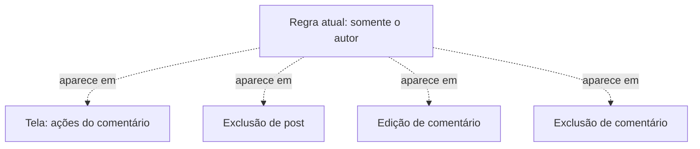
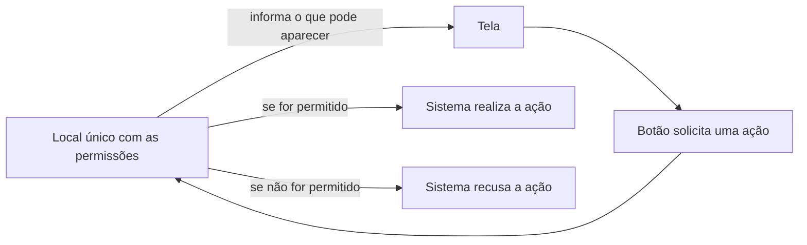

# ETAPA 1 — Diagnóstico de Manutenção Preventiva

- **Disciplina:** Manutenção e Integração de Software
- **Equipe:** Dayane Rodrigues, Lucas Marinho e Victória Caroline Alves
- **Professor:** Andrey Rodrigues

## 1. Fundamentação e objetivo

No Capítulo 4 do livro *Fundamentos de Manutenção de Software*, Marco Tulio Valente apresenta formas de organizar o código para que mudanças futuras possam ser realizadas com menor impacto. Entre os conceitos discutidos está o **Ocultamento de Informação**, segundo o qual decisões que podem mudar devem ficar concentradas em um módulo, sem que seus detalhes sejam espalhados por outras partes do sistema.

Esse conceito foi utilizado para analisar as regras de permissão do Swiftline. Atualmente, essas regras são simples, pois somente o autor pode editar ou excluir seu próprio conteúdo. Entretanto, a forma como foram implementadas poderá dificultar a inclusão de novos tipos de usuário e de novas permissões. Por esse motivo, foi investigado como uma futura função de moderação afetaria a estrutura atual.

## 2. Problema identificado

Ao analisar o código, observou-se que a decisão sobre quem pode editar ou excluir um conteúdo não está concentrada em um único local. Essa regra aparece em três operações internas do sistema e também na tela de comentários.

Essas verificações funcionam de maneira independente. Isso significa que alterar uma delas não modifica as demais. É como se o sistema guardasse várias cópias da mesma regra: enquanto todas dizem a mesma coisa, não há diferença visível; quando uma regra muda, cada cópia precisa ser encontrada e atualizada. Se alguma for esquecida, uma parte do sistema continuará seguindo a regra antiga.

## 3. Localização e funcionamento atual

Os pontos relacionados ao problema são os seguintes:

| Arquivo e linha | Operação | Regra atual |
| --- | --- | --- |
| `sistema/src/app.ts:282` | Exclusão de post | Somente o autor do post pode excluí-lo. |
| `sistema/src/app.ts:291` | Edição de comentário | Somente o autor do comentário pode editá-lo. |
| `sistema/src/app.ts:292` | Exclusão de comentário | Somente o autor do comentário pode excluí-lo. |
| `sistema/client/App.tsx:120` | Ações de comentário | A mesma condição mostra os botões **Editar** e **Excluir** quando o comentário pertence ao usuário conectado. |

Quando alguém tenta editar ou excluir um conteúdo, o sistema identifica o usuário conectado e verifica se ele é o autor. Caso não seja, a operação é recusada e o sistema informa que esse usuário não possui permissão.

Na tela de comentários, uma comparação semelhante é usada para mostrar ou ocultar os botões. Essa verificação apenas decide o que aparece para o usuário, enquanto a confirmação da permissão acontece novamente quando ele tenta realizar a ação.

*Figura 1 — Locais em que a regra atual de permissão aparece. Fonte: elaborada pelos autores com base no código do Swiftline (2026).*

## 4. Mudança futura de referência

A mudança escolhida para esta análise é a inclusão do papel de **moderador**. Por se tratar de uma rede social com publicações e comentários feitos pelos usuários, é plausível que futuramente seja necessário remover conteúdos que violem as regras da plataforma.

Nesse cenário, o moderador poderá excluir posts e comentários de outras pessoas. Ele não poderá, porém, editar comentários alheios, pois isso significaria modificar uma mensagem em nome de seu autor. Essa funcionalidade ainda não existe no Swiftline e foi definida somente como referência para avaliar a manutenção do código atual.

## 5. Dificuldade esperada

Para incluir essa regra na estrutura atual, seria necessário alterar separadamente os pontos que cuidam da exclusão de posts e de comentários, permitindo a ação do moderador. Ao mesmo tempo, a edição de comentários deveria continuar restrita ao autor.

A tela também precisaria ser revista. Hoje, os botões **Editar** e **Excluir** são controlados pela mesma condição. Se essa condição fosse simplesmente ampliada para incluir moderadores, os dois botões seriam exibidos, embora somente a exclusão devesse estar disponível para esse papel.

Como esses pontos são independentes, a alteração de um deles não corrige os outros. Por exemplo, se a exclusão de comentários fosse atualizada, mas a exclusão de posts fosse esquecida, o moderador conseguiria excluir comentários, mas continuaria impedido de excluir posts. Da mesma forma, se a permissão fosse alterada apenas na parte interna do sistema, o botão correspondente poderia não aparecer na tela. Se apenas a tela fosse alterada, o botão apareceria, mas a ação seria recusada.

A relevância do problema, portanto, não está na quantidade de linhas usadas pelas verificações atuais, mas no risco de manter várias cópias independentes de uma regra de permissão. Um esquecimento poderá fazer partes do Swiftline se comportarem de formas diferentes. Uma alteração incorreta poderá até permitir que alguém modifique um conteúdo que não lhe pertence.

## 6. Intervenção preventiva proposta

Como intervenção preventiva, propõe-se reunir as regras de permissão em um único local do sistema. Esse local será responsável por decidir, de forma separada, quem pode editar um comentário, excluir um comentário ou excluir um post. As operações deixarão de manter cópias próprias da regra e passarão a consultar essa decisão central.

Também se propõe que a tela receba a informação sobre quais ações estão disponíveis para cada conteúdo. Com isso, os botões de edição e exclusão poderão ser tratados separadamente, sem que a tela precise repetir a regra.

É importante diferenciar a ação da permissão. O local central não será responsável por editar ou excluir o conteúdo. Ele apenas informará se a pessoa pode realizar a ação. O botão continuará solicitando a edição ou a exclusão, mas será mostrado de acordo com essa resposta. Quando alguém clicar nele, a permissão será conferida novamente antes que a ação seja realizada.

No caso futuro do moderador, esse local informará que a edição de comentários não é permitida, enquanto a exclusão de posts e comentários é permitida. Por isso, a tela mostrará o botão **Excluir**, mas não o botão **Editar**. A regra sobre o moderador não ficará escrita nos botões; eles apenas seguirão a resposta recebida.

No primeiro momento, o comportamento do Swiftline permanecerá igual: somente o autor terá essas permissões. A mudança será apenas na organização interna. Testes deverão confirmar que o autor continua autorizado, que os demais usuários continuam bloqueados e que todas as operações utilizam a mesma regra.

*Figura 2 — O botão solicita a ação, enquanto o local central decide se ela pode ser realizada. Fonte: elaborada pelos autores (2026).*

Depois dessa intervenção, ainda será necessário registrar o papel de moderador nos dados dos usuários e reconhecê-lo durante o acesso ao sistema. Entretanto, a decisão sobre o que ele poderá fazer ficará concentrada no novo local. Essa organização aplica o **Ocultamento de Informação**, pois as demais partes do sistema utilizarão a decisão sem repetir a regra.

Trata-se de manutenção preventiva porque a estrutura será modificada antes da criação dos moderadores e sem alterar o funcionamento atual. O objetivo é reduzir o esforço e o risco de inconsistência quando essa mudança for necessária.

## Referência

VALENTE, Marco Tulio. *Fundamentos de Manutenção de Software*. Capítulo 4: Código Flexível a Mudanças. Disponível em: <https://manutencaosoftware.org/cap4>. Acesso em: 5 set. 2026.
